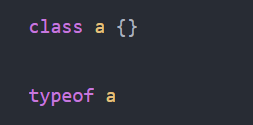
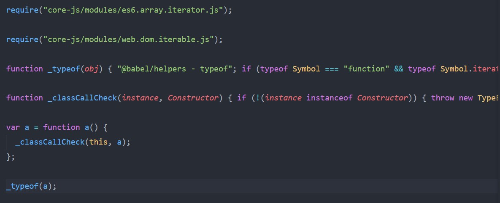
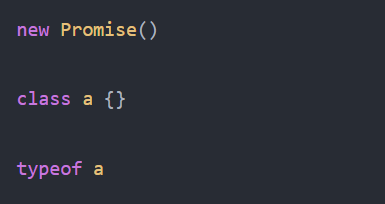
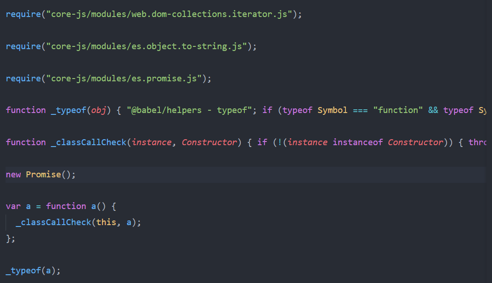
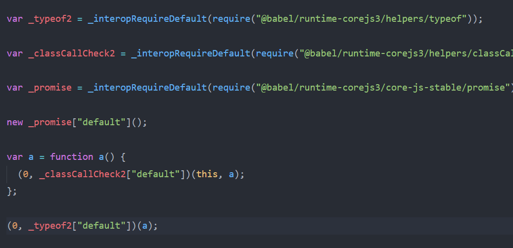

这篇主要讲 polyfill 和 plugin-transform-runtime

Babel 在处理代码时主要包括 `syntax（语法）` 和 `api` 两个方面。而 Babel 默认只转换`syntax`。

转换前：

```js
let array = [1, 2, 3, 4, 5, 6]
array.includes(item => item > 2)
new Promise()
```

转换后：

```js
var array = [1, 2, 3, 4, 5, 6]
array.includes(function(item) {
  return item > 2
})
new Promise()
```

对于上述例子，babel 只处理了箭头函数 、let 这些语法层面的转换，对于 `Array.includes`、`window.Promise` 等 api，并没有做处理。事实上不是所有浏览器都支持这些 api。因此需要使用 `polyfill`。

## polyfill

polyfill 在英文中有垫片的意思，意为兜底的东西。在计算机科学中，指的是对未能实现的客户端上进行的"兜底"操作。

由于 ECMAScript 的迅速成长以及浏览器的频繁更新换代，每年都会出现新的 api，不同浏览器之间支持的 api 也不尽相同。

在前端中，像箭头函数、let、const、class 等语法，无法在`运行时`通过 JavaScript 进行模拟重写，只能在`编译时`，对其进行语法转换。

而不同于 `syntax`，由于 JavaScript 是动态语言的特性，这使得我们可以在`运行时`对类进行操作，模拟重写 api，来抹平各个浏览器之间 api 的差异，进行"兜底"。

诸如，在不支持 `Array.includes` 的浏览器，对 Array 添加 includes 方法：

```js
if (!Array.prototype.includes) {
  Object.defineProperty(Array.prototype, 'includes', ...)
}
```

在这方面广为人知的便是开源库 `zloirock/core-js` 。

`zloirock/core-js` 按照严格规范，用 ES3 语法实现了大部分的 ES2015+ 原生标准库。使得我们使用诸如 `Array.includes`、`Object.assign` 这样的 api 时, 不用再顾及浏览器是否支持。

同时 `zloirock/core-js` 也是 `@babel/polyfill` 的底层依赖。

`@babel/polyfill` 库模拟一个完整的 ES2015+ 环境，内部包括了 `regenerator runtime` 和 `core-js`，只需要在项目入口的一开始处引入。

```js
// main.js

require('@babel/polyfill')

// do something ...
```

而在 Babel 7.4.0 开始，官方不再建议你直接引入 `@babel/polyfill` 这个库，而是改为引入 `core-js/stable` 和 `regenerator-runtime/runtime`

```js
// main.js
import 'core-js/stable'
import 'regenerator-runtime/runtime'

// do something ...
```

:::tip
这里的 `regenerator-runtime/runtime` 模块用于 `生成器函数`、`async`、`await`等语法的功能实现。
:::

这种方式可以简单粗暴的解决兼容性问题，但随之带来的问题是整个 `polyfill` 太大。如果说我的项目中只用到了部分 api，而 `polyfill` 却把整个 ES2015+的 api 都囊括进来，这未免显得得不偿失。我们希望 Babel 可以按需加载这些 api。

因此 Babel 建议我们在使用 `polyfill` 时，可以配合 `@babel/preset-env` 使用。

通过设置 `@babel/preset-env` 预设参数选项中的 useBuiltIns 属性，来告知如何处理 `polyfill`

useBuiltIns 有以下一些可选项：

```js
module.exports = {
  presets: [
    [
      '@babel/preset-env',
      {
        // 默认值 false 表示什么也不干
        useBuiltIns: false,
        // entry 表示将加载全部 polyfill,
        useBuiltIns: 'entry',
        // usage 表示按需加载 polyfill，只会加载你用到的一些 polyfill
        useBuiltIns: 'usage'
      }
    ]
  ]
}
```

:::tip
小结：`Babel` 只是转换 `syntax` 层语法，所以需要 `polyfill` 来处理 API 兼容，又因为 `polyfill` 体积太大，所以通过 preset 的 useBuiltIns 来实现按需加载。
:::

## plugin-transform-runtime

尽管到目前为止，上面的 `polyfill` 都很好的满足了我们日常开发中使用 ES2015+ 语法的需求。可事实上，`polyfill` 还存在着以下一些问题：

1. `polyfill` 在对象上重写添加的 `api` 方法，会因为直接修改了全局变量的原型，导致变量污染，可能会带来意想不到的问题。

例如：你在开发中使用了 `window.Promise` 方法，按照 Babel polyfill 编译后，提供给其他人使用，但其他人的代码中有可能自定义重写了一套 `window.Promise`。

```js
window.Promise  = function (){
    this.reject = ..
    this.resolve = ..
}
```

这时便会造成了变量污染。我们希望 polyfill 编译后的 `Promise` 方法能被赋值在局域的一个变量上，如 `_Promise`。这样开发时使用的 `window.Promise`，编译后是 `_Promise`。

2. Babel 转译 syntax 时，有时候会使用一些辅助的函数来帮忙转换。

编译前：



编译后：



这其中 `_typeof`、`_classCallCheck` 都是编译后添加的辅助函数，从上图中可以看到，辅助函数直接在转译后的文件里被定义了一遍，这导致如果我编译多个文件，那么每份文件都会重复添加这些辅助函数，这显然不合理。

因此，为了解决上述两个问题，babel 提供了 `@babel/plugin-transform-runtime` 这个插件,这个插件需要配合 `@babel/runtime` 库进行使用。

```
yarn add @babel/runtime
yarn add @babel/plugin-transform-runtime --dev
```

:::tip
其中 `@babel/runtime` 在运行时起作用，因此需要添加到 dependencies，而非 devDependencies
:::

```json
{
  "presets": [
    [
      "@babel/preset-env",
      {
        "useBuiltIns": "false"
      }
    ]
  ],
  "plugins": [
    [
      "@babel/plugin-transform-runtime",
      {
        "corejs": 3
      }
    ]
  ]
}
```

:::tip
配置项中的 corejs 指定 runtime-corejs 的版本，目前有 2、3 两个版本。值得注意的是，像 `"foobar".includes("foo")` 这样的实例方法的转换处理只在 core-js@3 中才会工作。
:::

示例：

源代码：



不使用 `@babel/plugin-transform-runtime` 编译后：



使用 `@babel/plugin-transform-runtime` 编译后



可以看到，在使用 `@babel/plugin-transform-runtime` 编译后，`Promise` 被替换成了 `_promise['default']`，避免了命名污染的问题。

同时，直接声明的辅助函数也改为了统一引入 `@babel/runtime-corejs3` 的方式，避免了重复声明。

由此，上述两个问题都得到了很好的解决。
