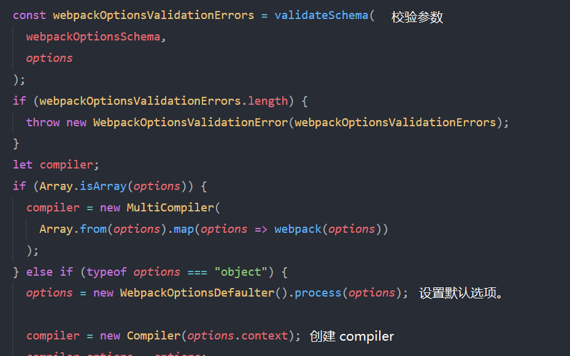

现有个 webpack.config.js 如下：

```js
module.exports = {
  mode: 'development',
  entry: './src/index.js',
  module: {
    rules: [
      {
        test: /\.js$/,
        use: ['babel-loader']
      }
    ]
  }
}
```

执行命令

```shell
webpack --config webpack.config.js
```

### 执行命令过程

1. 通过 shell 运行的脚本，通常会寻找模块的 package 中的 bin 字段作为程序启动的入口。

2. 如果非通过 npx 或 package scripts 运行，会寻找 npm global 安装的 webpack，默认可在 `C:\Users\xx\AppData\Roaming\npm\node_modules\webpack` 中找到。

3. 而通过 npx 或 package scripts 运行, 则会寻找当前目录下的 node_modules 的 webpack。

4. 执行命令后，运行 `webpack/bin/webpack.js`。

`webpack/bin/webpack.js` 中会调用 cli，对终端传入的参数进行解析。

可以适用 `webpack-cli` 或者 `webpack-command`。只会寻找其中一个进行执行。如果两个都安装了，会抛出警告，并停止后续的执行。

在这其中判断是否安装了 `webpack-cli` 或者 `webpack-command`，是通过调用 require.resolve 查询某个模块文件的带有完整绝对路径的文件名。如果捕获到异常就是没有安装。

```js
const isInstalled = (packageName) => {
  try {
    require.resolve(packageName)

    return true
  } catch (err) {
    return false
  }
}
```

如果都没有安装，则会通过 readLine 在终端中询问是否安装 `webpack-cli`，如果允许，则通过 `runCommand` 安装 `webpack-cli`

5. 最终通过 require `webpack-cli` 或者 `webpack-command`， 调用 cli。

### webpack-cli

`webpack-cli` 的程序入口是 `webpack-cli/bin/cli`，其入口是一个立即执行函数，会在被 `webpack` require 后，立即执行。

1. 调用 `import-local` 判断本地环境是否安装了 `webpack-cli`，如果是，则优先使用本地环境的 `webpack-cli`。

2. 引入 `v8-compile-cache` 进行编译缓存。

3. 通过 `yargs` 对终端 shell 参数进行解析。

4. 在 `require("./utils/convert-argv")` 中，处理终端参数，请求 `webpack.config.js`，并合并两者的选项参数。

5. 处理完参数之后，引入 `webpack`, 这里的 webpack 是运行主入口文件，即 package 中的 main 字段：`webpack/lib/webpack.js`。 传入参数，并执行。

同时在 webpack 方法返回的 compiler 对象上，通过 `hooks.watchRun.tap` 和 `hooks.beforeRun.tap` 订阅事件，等待触发时，打印一些信息。

6. 调用 compiler 对象中的 run 方法开始执行本次编译。在 compiler.close 之后，执行编译结束的回调，在回调中，如果需要生成 stats，即生成。

### webpack/lib/webpack.js

在 `webpack-cli` 中执行了 `webpack` 方法并传入选项之后。`webpack/lib/webpack.js` 会调用 `validateSchema` 方法对选项参数进行校验。然后通过 new Compiler() 创建一个编译对象。（这里如果参数选项是一个数组，会创建多个 compiler）。



1. 在创建完 `compiler` 之后，会挂载 `NodeEnvironmentPlugin`，这个插件主要是封装一些读取文件，生成文件，监听文件的一些方法，大部分都是 node 文件系统的一些 api。

2. 执行在选项中配置的 plugins，诸如 `webpack-html-plugin`。


3. 之后，会根据选项配置，挂载一些内置的 `plugin`，诸如 `ExternalsPlugin`、`CommonJsPlugin`

```js
compiler.options = new WebpackOptionsApply().process(options, compiler)
```

:::tip
从第二点来看，webpack 中的插件，通常是一个类，拥有一个 `apply` 方法，该方法接受 `compiler` 对象作为参数。也可以是一个函数，在调用时会将通过 call 方法，将上下文指向 `compiler`，并接受 `compiler` 对象作为参数。在插件中通过向 hooks 中订阅事件，等待在编译过程中被触发。
:::

4. 最终 `webpack` 执行完，返回 `compiler` 对象。

### Compiler 类

接上面，`webpack-cli` 中会调用 `compiler` 对象中的 `run` 方法开始执行本次编译。`compiler` 实例通过 `new Compiler` 得来。观察 `Compiler` 类，该类继承 `Tapable` 类。

`Tapable` 是一个类似于 EventEmitter 的一个发布/订阅事件的库。`webpack` 通过在其上面订阅事件，并在编译过程中的不同阶段被调用触发。

不了解 `tapable` 的，可以先查阅文档：

1. [Tapable](https://babel.docschina.org/docs/en/plugins/)
2. [webpack compiler hooks](https://webpack.js.org/api/compiler-hooks/)

跳过 `new Compiler` 时构造方法中繁杂的变量声明。我们看 `compiler` 被执行的 `run` 方法中做了些什么。

1. `this.running` 在构造方法中被赋值为 `false`。表示编译器是否正在运行。如果已经启动，就退出编译。避免重复运行。

2. `onCompiled` 是在编译成功之后的执行的回调。

3. 触发钩子 `hooks.beforeRun`，这个钩子在运行之前被执行。可以搜索 `hooks.beforeRun.tap` 看这个钩子在内部订阅了那些事件。

4. 触发钩子 `hooks.run`，这个钩子在运行时被执行。可以搜索 `hooks.run.tap` 看这个钩子在内部订阅了那些事件。

5. 在执行相应钩子，读取记录之后，调用 `this.compile`，并传入回调 `onCompiled`。

接下来看 `this.compile` 方法中做了些什么。

1. 调用 `newCompilationParams` 方法，返回 `newCompilation` 需要的参数。参数对象中包含 `normalModuleFactory` 、`contextModuleFactory`、`compilationDependencies`。后面在用到时，我们会见解。

2. 触发 `hooks.beforeCompile` 、 `hooks.compile` 钩子之后。调用 `newCompilation` 生成一个 `compilation` 对象。

3. `newCompilation` 中会调用 `createCompilation` 方法生成一个 `compilation` 对象。触发 `hooks.thisCompilation`，`hooks.compilation` 钩子。

值得注意的是，`hooks.compilation` 会触发在 `SingleEntryPlugin` 插件中订阅的事件。

```js
compiler.hooks.compilation.tap(
  'SingleEntryPlugin',
  (compilation, { normalModuleFactory }) => {
    // 由 newCompilationParams 生成的其中一个参数 `normalModuleFactory` 方法
    // 会被 set 进 dependencyFactories 里面。
    // key 是 SingleEntryDependency。后面会根据这个 key 取出执行。
    compilation.dependencyFactories.set(
      SingleEntryDependency,
      normalModuleFactory
    )
  }
)
```

4. 触发 `hooks.make` 钩子。

... 未完待续。
