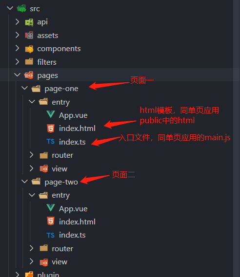

# 基于 Vue CLI 3  实现多页打包

## 单页应用和多页应用

### 单页应用

以单个 html 页面作为外壳页面，并在外壳页面一次性加载项目所依赖的资源（CSS、JS）。项目中其他页面作为页面片段在外壳页面中进行无感切换，例如：利用 H5 的 History 监听到 URL 的变化，对页面片段进行切换（删除和添加）

### 多页应用

根据实际项目业务场景划分，webpack 多个入口文件分包打包后，构建多个单页应用。

## webpack 构建多页应用

1. entry 入口中引入多个入口文件
2. 为每个页面配置一个 HTMLWebpackPlugin

```js
const getHtmlWebpackPluginParams = (template, title) => {
  return {
    filename: `view/${template}.html`, // 生成的文件放在/dist/view目录下
    template: resolve(`src/view/${template}.html`), // 模板的位置
    title: title, // 设置HTML文件中的title值
    inject: true, // 插入的script标签放在body后面
    hash: true, // 产生hash值
    chunks: [template, 'common'] // script标签中插入的文件为对应html文件的js以及公用的common
  }
}

const config = {
  entry: {
    pageOne: './src/pageOne/index.js',
    pageTwo: './src/pageTwo/index.js',
    pageThree: './src/pageThree/index.js'
  },

  plugins: [
    new HTMLWebpackPlugin(getHtmlWebpackPluginParams('pageOne', '页面一')),
    new HTMLWebpackPlugin(getHtmlWebpackPluginParams('pageTwo', '页面二')),
    new HTMLWebpackPlugin(getHtmlWebpackPluginParams('pageThree', '页面三'))
  ]
}
```

## Vue CLI 3 构建多页应用

- 使用 vue cli 3 初始化项目,后修改项目结构如下:



::: tip
可以按具体需求和场景构建项目结构，vue.config.js pages 中相应资源路径配置正确即可。
:::

- 在 vue.config.js 中 为 pages 配置多个入口

```js
const resolve = dir => path.join(__dirname, `../../src/pages/${dir}`)

module.exports = {
  pages: {
    'page-one': {
      entry: resolve('page-one/entry/index.ts') // 入口文件,
      template: resolve('page-one/entry/index.html') // html 模板入口,
      filename: 'page-one/index.html', // 在 dist/page-one/index.html 的输出
      chunks: ['chunk-vendors', 'chunk-common', 'page-one'] // 提取的 js 块
    },
    'page-two': {
      entry: resolve('page-two/entry/index.ts'),
      template: resolve('page-two/entry/index.html'),
      filename: 'page-two/index.html',
      chunks: ['chunk-vendors', 'chunk-common', 'page-two']
    },
    ...
  }
}
```

- 优化一下 pages 配置

```js
const resolve = dir => path.join(__dirname, `../../src/pages/${dir}`)

const pages = modules => {
  const pages = {}
  modules.forEach(module => {
    pages[module] = {
      entry: resolve(`${module}/entry/index.ts`),
      template: resolve(`${module}/entry/index.html`),
      filename: `${module}/index.html`,
      chunks: ['chunk-vendors', 'chunk-common', module]
    }
  })
  return pages
}

module.exports = {
  pages: pages('page-one', 'page-two')
}
```

这样就完成了最初的多页打包配置，但是每次打包都需要手动修改 vue.config.js 中的文件名，来分别打包不同的页面，不是很方便。
我们可以通过 npm run serve/test/build `pages` 这种方式来分别打包不同的页面。通过命令运行的 `脚本参数` 来具体知道需要打包的模块（全部模块打包还是只打包一个或多个模块），因此 vue-config.js 中的 pages 选项的配置就需要根据 `脚本参数` 来动态生成。

## 动态生成 vue.config.js

- 通过 [minimist](https://github.com/substack/minimist) 来解析脚本参数选项
- 通过 [json-templater](https://github.com/lightsofapollo/json-templater) 将模板字符串中的 `{{}}` 解析替换
- 将 json-templater 处理好的字符串 通过 `fs.writeFileSync(path, string)` 生成 vue.config.js

新建一个 scripts 目录

scripts/utils/vueConfigTemplate.js 用于事先定义好 vue.config.js 模板

<<< @/docs/core/vue/assets/vueConfigTemplate.js

scripts/utils/helper.js 中 getWholeModule 用于在未传进命令参数时获取全部页面的文件名

<<< @/docs/core/vue/assets/helper.js

scripts/utils/pages.js

<<< @/docs/core/vue/assets/pages.js

scripts/task/vueConfigRender.js 执行该脚本生成 vue-config.js

<<< @/docs/core/vue/assets/vueConfigRender.js

执行 `node scripts/task/vueConfigRender.js [参数]`, 如：`node scripts/task/vueConfigRender.js page-one` 即可以看到项目目录下生成的 vue-config.js

但我们需要在 `npm run serve/test/build [参数]` 的时候, 执行 scripts/task/vueConfigRender.js 并且在生成 vue-config.js 后运行 `vue-cli-service serve/build`。这时候可以通过 [execa](https://github.com/sindresorhus/execa) 来执行上述的命令

- 将 `package.json` 中的 `script` 修改如下：

```json
{
  "scripts": {
    "serve": "node scripts/serve.js",
    "build": "node scripts/build.js"
    // "test": "node scripts/test.js"
  }
}
```

- 新建 scripts/serve.js 执行 node scripts/task/vueConfigRender.js 再执行 vue-cli-service serve

<<< @/docs/core/vue/assets/serve.js

- 新建 scripts/build.js 执行 node scripts/task/vueConfigRender.js 再执行 vue-cli-service build

<<< @/docs/core/vue/assets/build.js

## 优化打包后的目录结构

执行完 `npm run build` 后 我们得到是这样得一个 dist 文件，目录结构如下：

```
.
├─ css
├─ img
├─ js
├─ page-one
   └─ index.html
└─ page-tow
   └─ index.html
```

打包后的 dist 文件中的 js/css/img 等静态资源并不会根据不同的页面模块放置。如果我们需要将不同的页面部署在不同的服务上，我们并不能清楚的知道 那些静态资源属于 page-one, 那些属于 page-tow。因此我们希望打包后的目录结构是这样的:

```
.
├─ page-one
   ├─ css
   ├─ img
   ├─ js
   └─ index.html
└─ page-tow
   ├─ css
   ├─ img
   ├─ js
   └─ index.html
```
